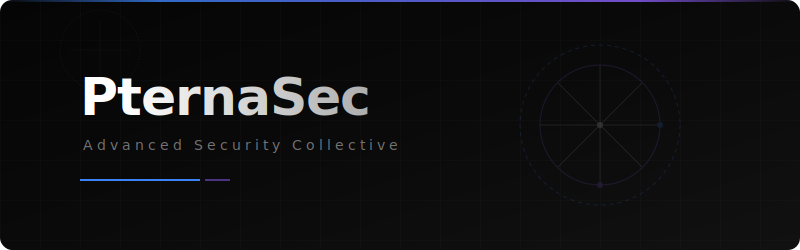

  

 

  <h3>Investigación Avanzada en Ciberseguridad & Vulnerability Training</h3>

**PternaSec** es un colectivo especializado en ciberseguridad enfocado en el desarrollo de recursos Open-Source. Proveemos guías estratégicas para operaciones ofensivas ($\textsf{\color{#ef4444}Red Team}$), defensivas ($\textsf{\color{#3b82f6}Blue Team}$), laboratorios de vulnerabilidades ($\textsf{\color{#10b981}Vuln-Labs}$) y herramientas automatizadas para la recolección de inteligencia ($\textsf{\color{#8b5cf6}OSINT}$).

 

  

## Dominios Principales

<table width="100%">
  <tr>
    <td align="center" width="25%">
      
       
      <strong>Red Team & Offense</strong>
    </td>
    <td align="center" width="25%">
      
       
      <strong>Blue Team & Defense</strong>
    </td>
    <td align="center" width="25%">
      
       
      <strong>Vulnerability Labs</strong>
    </td>
    <td align="center" width="25%">
      
       
      <strong>Scripts & PoCs</strong>
    </td>
  </tr>
</table>

## Repositorios Oficiales

<table width="100%">
  <tr>
    <td align="center" width="25%">
      <a href="https://github.com/PternaSec/scripts">
        
         
        <strong>Scripts Library</strong>
      </a>
    </td>
    <td align="center" width="25%">
      <a href="https://github.com/PternaSec/vuln-labs">
        
         
        <strong>Vuln-Labs Repo</strong>
      </a>
    </td>
    <td align="center" width="25%">
      <a href="https://github.com/PternaSec/news">
        
         
        <strong>Security News</strong>
      </a>
    </td>
    <td align="center" width="25%">
      <a href="https://github.com/PternaSec/cli-core">
        
         
        <strong>CLI Core Engine</strong>
      </a>
    </td>
  </tr>
</table>

## 🔥 Últimas Alertas y Publicaciones

<!-- START_SECTION:news -->
* 🔴 **[Critical]** *Placeholder:* Análisis de Zero-Day y mitigaciones.
* 🟡 **[Warning]** *Placeholder:* Evasión de defensas y Syscalls directas.
* 🟢 **[Info]** *Placeholder:* Nuevo Vuln-Lab de Active Directory disponible.
<!-- END_SECTION:news -->

 

### Descripción de Componentes

- **[Website-PternaSec](https://pternasec.vercel.app/)** - La plataforma web interactiva principal que integra laboratorios, scripts y recursos de inteligencia. Desarrollada con Next.js y TailwindCSS.
- **[Scripts Library](../../scripts/)** - Una colección curada de *Proof of Concepts (PoCs)*, frameworks de OSINT y scripts de automatización para auditorías autorizadas.
- **[Vulnerability Labs](../../vuln-labs/)** - Entornos en contenedores aislados y vulnerables para entrenamiento práctico de explotación y fortificación defensiva (Hardening).
- **[Security News](../../news/)** - Boletines de seguridad accionables, análisis de vulnerabilidades críticas y alertas de Zero-Day.
- **[CLI Core Engine](../../cli-core/)** - El núcleo de ejecución y motor de línea de comandos para la orquestación de herramientas internas.

 

  

    <a href="https://pternasec.vercel.app">Platform</a> |
    <a href="https://pternasec.vercel.app/home">Home</a>
  

  *$\textsf{\color{#8b5cf6}Construyendo sistemas seguros a través de ofensiva práctica.}$*

 

  <h2> Únete al Colectivo</h2>
  
PternaSec es un esfuerzo impulsado por la comunidad. Si eres investigador de seguridad, pentester o desarrollador, te invitamos a contribuir a nuestros laboratorios y herramientas open-source.

 

> **¿Por qué PternaSec?** 
> *Pterna* (πτέρνα) proviene del griego y significa "talón", en alusión directa al **Talón de Aquiles**. En PternaSec nos dedicamos a descubrir, estudiar y asegurar aquellas vulnerabilidades críticas (el talón de Aquiles) que comprometen los sistemas modernos, fortaleciendo la ciberseguridad desde su punto más débil.
